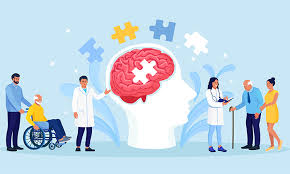
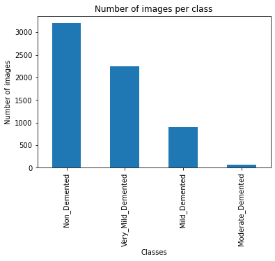
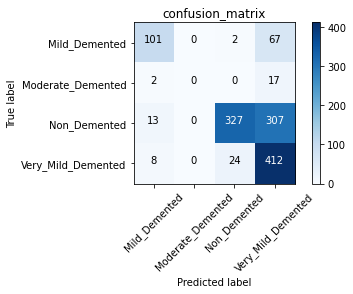
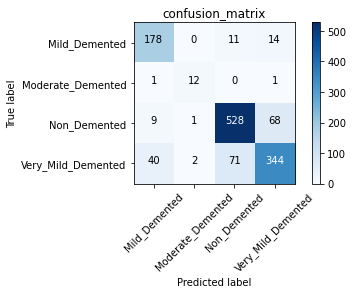

# Predicting Alzheimer's Disease by classifying MRI Images

## Overview

Through this project, We will build a classifier model to analyze a set of brain MRI Images for detecting Alzheimer's Disease. The model can classify data based on reading the brain MRI Images. Create a predictive classification model that makes it possible to understand the business problem, solve it and report the findings of the final model, including predictions and performance metrics.
 

## Business Understanding

Alzheimer's disease (AD) is an irreversible brain degenerative disorder affecting people aged older than 65 years. Currently, there is no effective cure for AD, but some treatments can delay its progression. Accurate and early diagnosis of AD is vital for patient care and the development of future treatment.

The main motive behind the project is developing a classification model for detecting AlzheimerDisease to help Alzheimer’s researchers in New york Alzheimer’s center-continue to pursue drug treatments for the disease, most agree that successful treatment will hinge on early detection and on finding ways to head off brain damage before the later stages of Alzheimer’s .

## Data Understanding

This project uses the Alzheimer MRI dataset from Kaggle.Data  collected from several websites/hospitals/public repositories. The Dataset consists of a total of 6400 MRI images. The images stored in .jpeg files under the folder '/Dataset' .
All images resized into 128 x 128 pixels. Target  divided into four classes :

Class - 1: Mild Demented (896 images)

Class - 2: Moderate Demented (64 images)

Class - 3: Non-Demented (3200 images)

Class - 4: Very Mild Demented (2240 images)

## Modeling

Computer vision is a field of artificial intelligence (AI) that enables computers and systems to derive meaningful information from digital images, videos, and other visual inputs — and take actions or make recommendations based on that information. Computer vision trains machines to observe and understand images.

Two essential technologies are used to accomplish this: a type of machine learning called deep learning and a convolutional neural network (CNN).

### Baseline Model: Multi-Layer neural network 

Build a Baseline Model for a Multi-Layer neural network to solve image classification.
Keras library can be used to build a neural network to solve a classification problem.

Keras is an API that sits on top of Google’s TensorFlow. 
Basically, a neural network is a connected graph of perceptrons. Each perceptron is just a function. In a classification problem, its outcome is the same as the labels in the classification problem. 

By using the Keras library we will build a sequential model, this is the simplest type of data structure in Keras and is a sequence of connected layers in a network

In any neural network, a dense layer is a layer that is deeply connected with its preceding layer which means the neurons of the layer are connected to every neuron of its preceding layer.

 
 
 
 ### Final Model : Convolutional neural network (CNN)
 
Convolutional neural network models work phenomenally well on computer vision tasks like image classification, object detection,and image recognition.

The convolutional neural network has two types of layers: Convolution and Padding.
 
Convolution: reducing the size of the numerical representation sent to the CNN.Only features that are important in classifying an image are sent to the neural network by applying a filter which is usually a 3*3 matrix.

This is done by sliding the kernel on the input image. The sliding happens in steps known as strides. 

Padding: Padding involves increasing the size of the input image by “padding” the images with zeros. As a result, applying the filter to the image leads to a feature map of the same size as the input image. 

## Evaluation

The best model based on performance and Recall is the Convolutional neural network with Data augmentation.

We evaluated our final model based on the Recall score metric as well as the F1 score, and the model accuracy which equals 83% .

Recall — What percent of the positive cases did the model catch?

Recall = TP/(TP+FN)

How to calculate FN, FP, TN, and TP for multi classes? 

TP: The True positive value is where the actual value and predicted value are the same. 

FN: The False-negative value for a class will be the sum of values of corresponding rows except for the TP value. 

FP: The False-positive value for a class will be the sum of values of the corresponding column except for the TP value. 

TN: The True Negative value for a class will be the sum of values of all columns and rows except the values of that class that we are calculating the values for.

Confusion Matrix gives a comparison between Actual and predicted values.Confusion Matrix allows us to measure the Recall, Precision, and Accuracy of the model. 

class 0 (Mild Demented):

TP: The model predicted that 178 cases are belong to Mild Demented class and that is actually true.

FN: The model predicted that (0 + 11 + 14) = 25 cases are not  belong to Mild Demented class and that actually false.

The recall for class 0 is 88%.

class 1 (Moderate Demented) :

TP: The model predicted that 12 cases are belong to Moderate Demented class and that is actually true.

FN: The model predicted that (1+ 0+1) =2 cases are not  belong to Moderate Demented Demented class and that actually false.

The recall for class 1 is 86%.

class 2(Non Demented) :

TP: The model predicted that 528 cases are belong to Non Demented class and that is actually true.

FN: The model predicted that (9+1+68) =78 cases are not  belong to Non Demented Demented class and that actually false.

The recall for class 2 is 87%.

class 3 (Very Mild Demented):

TP: The model predicted that 344 cases are belong to Very Mild Demented class and that is actually true.

FN: The model predicted that (40 +2+71)=113 cases are not belong to Very Mild Demented class and that is actually false.

The recall for class 3 is 75%.

## Conclusion and Recommendations

Currently, more than 55 million people live with dementia worldwide, and there are nearly 10 million new cases every year. Alzheimer's disease is the most common form of dementia and may contribute to 60-70% of cases.

There are three stages of Alzheimer's disease:

Mild_Demented,Moderate_Demented,Very_Mild_Demented

For anyone facing cognitive issues,the idea of obtaining an AD diagnosis is understandably terrifying. Early detection of the disease is worth finding ways to head off brain damage before the later stages of Alzheimer’s.

We are providing some recommendations for the researchers regarding Alzheimer’s Detection and Diagnosis :

1- Being aware of Alzheimer’s signs and symptoms is essential for diagnosing the disease. The characteristic symptoms include difficulties with memory, language, problem-solving, and other cognitive skills that affect a person’s ability to perform everyday activities.

2- Develop and maintain routine procedures for checking brain health and cognitive aging by making early brain screening that can determine the stage of disease and provide the proper Anti-dementia medicines for each case.

3- Publishing the new research paper, and keeping investigating new treatments can offer support for healthcare providers and improve the quality of life of patients and families.

## Next Steps

Further analyses could yield additional insights to further improve the model performance.

## For more information

Email :mays802004@ gmail.com 
GitHub :maysasaad

## Repository Structure

├── [images](https://github.com/maysasaad/Alzheimers-Detection/tree/main/images)

├── README.md (https://github.com/maysasaad/Alzheimers-Detection/edit/main/README.md)

├── [Presentation.pdf ](https://github.com/maysasaad/Alzheimers-Detection/blob/main/presentation.pdf)

└── [Jupyter notebook.ipynb](https://github.com/maysasaad/Alzheimers-Detection/blob/main/QuaternaryClassification.ipynb)
